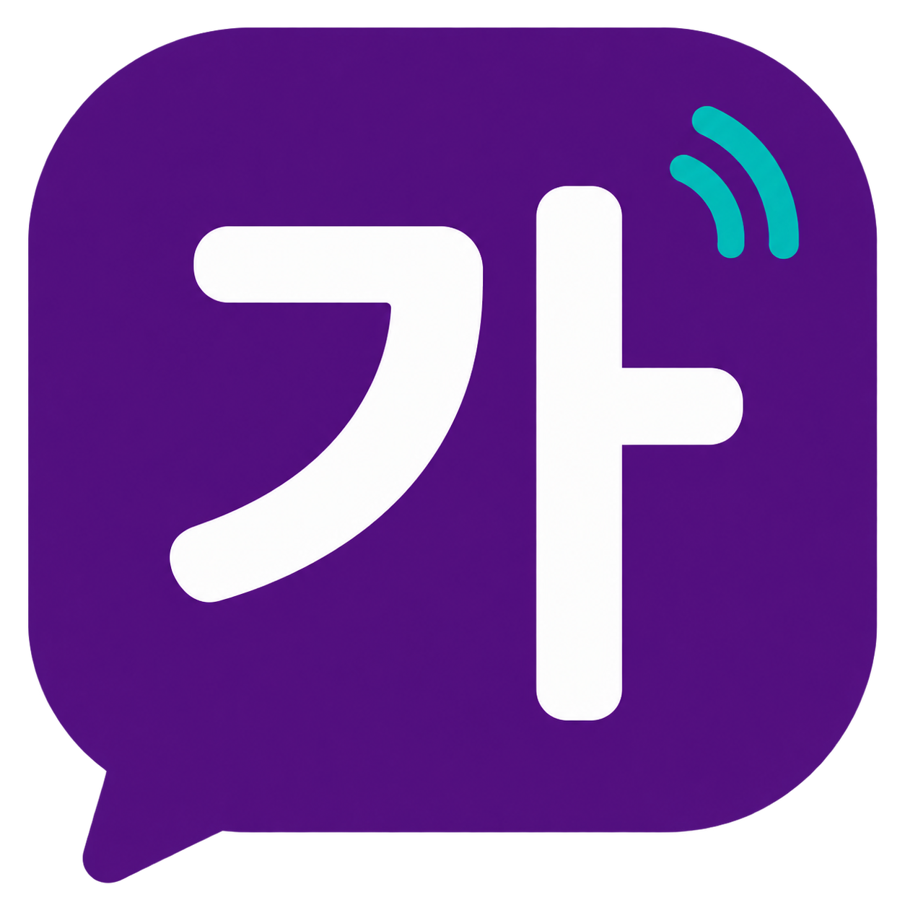

  

<h1 align="center">Korean Language Study Guide</h1>

<b>Your textbook, supercharged. You'll want to learn Korean just to keep using it.</b>

  <a href="https://korean.garrigai.com/">✨ Try it live ✨</a>

Forget hunting for CD tracks. This is *Integrated Korean: Beginning 1 (3rd edition)* turned into a lightning-fast, tap-to-hear study playground for Lessons 1–7 (additional lessons coming semester-by-semester).

Every conversation and narration is split line-by-line, color-coded by speaker, and ready to play instantly — on your phone, between classes, on the bus, in line for coffee.

### Why you'll love it

* **Hear it. Say it. Nail it.** Tap any Korean line to hear just that line. Tap any word to see what it means.
* **Play the turn, play it all.** Drill one speaker's turn on loop, or hit ▶ Play All and shadow the whole scene.
* **Built for real studying.** English on demand, 0.75x / 1x / 1.25x speed, Loop Line mode, keyboard shortcuts, full-text search across all lessons.
* **Kind to your eyes, kind to your phone.** Dark mode, adjustable text size, installable like a real app, works offline-ready.
* **Never lose your place.** It remembers your last lesson, links deep to any section, and resumes in one tap.

### Made for

ACC Riverbend students and staff, self-studiers, and anyone using *Integrated Korean: Beginning 1* who wants listening practice to feel like play, not homework.

Created by GarrigAI LLC as a personal study aid.

### Quick start

1. Open https://korean.garrigai.com/
2. Pick Lesson 1–7 → Conversation 1 / Conversation 2 / Narration
3. Tap ▶ on any line. Tap a word for its meaning. Tap EN for translation.
4. Add to Home Screen for full-screen app mode.

Pro tips: press `/` to search, `Space` to play all, `←` / `→` to skip 10s, `B` to loop a line.

---

*한국어를 공부해요? Come play.*
